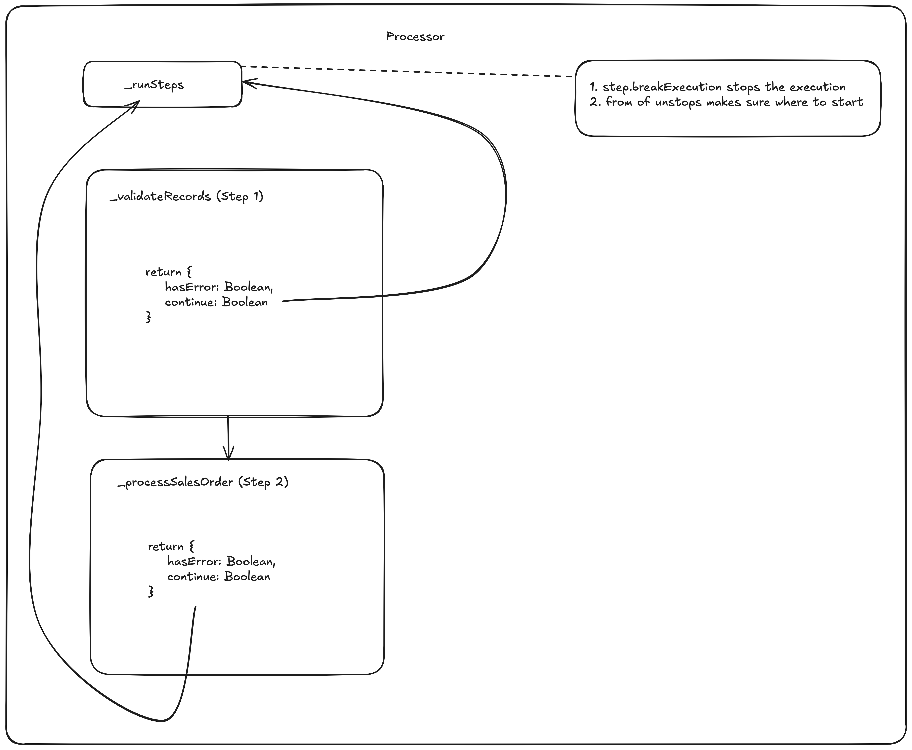

# Development Architecture of Monitor Application

This guide will document the current architecture & contract followed by the processing framework established by Monitor team.
We also try to document the best practices & flow to be followed while writing code for the same.

**NOTE**: This will be a living document and SHOULD BE ADJUSTED as and when the framework matures

## Systems Involved

1. S/4 HANA
2. SuccessFactors
3. BTP - Cloud Foundry - Extension Suite
4. BTP - Cloud Foundry - Integration Suite

## Artifacts Involved

Monitor app aims to manage interface types processing & provides a way to different format of data to be transformed into business objects (e.g. SalesOrder, SalesContract, EmployeeHires, etc.) before storing them in target systems (e.g. SuccessFactors, S/4 HANA)

This data format is basically configured as interface types in the app. Each interface types has a different structure of file & same file is then run through different steps before storing the data or generate the relevant business objects.

We have introduced two artifacts as part of our development framework that follow a standard API contract within different modules. Each **_Interface Type_** is mapped to something called a `Processor`. Each `processor` then can consume different `communicators`. Each `processor` can have multiple `steps`. This Framework is directly mapped to File Structure within [srv > handlers](./srv/handlers) directory.

- `communicators` - Each `.js` file maps exactly to one external API
- `processors` - Each `.js` file maps exactly to one Interface Type
- `processors > steps` - Optional: If there is a need to modularize the step processing then it can be moved to seperate file for better readability. Use as per need
- `configurations` - List of mappings (`.json`) that can be utilized by any implementation
- `common` - List of reuse utility / handlers that can be used by multiple processors or communicators

### Visualization


## Processor API

Each Processor is implemented as a Javascript Class

### Constructor Properties

- file - `Files` object
- recordIDs - array of record_ID (guid), if not provided, whole file is processed
- records - Optional, only if needed
- locale - while instantiating the processor instance pass on `req.locale`

### Methods

Following method should be implemented in each `Processor`

- _startProcess_ - Starts the process for EmployeeContractor from the provided step, otherwise from the beginning
- _runSteps_ - Runs the steps fetched from `InterfaceSteps` based on `interfaceType_ID` of `this.file`
- _validate_ - Should provide a way to setup the environment only for this particular validation step and make internal call to actual `runner` method

## Step Procesing Contract

Each step should take two input:

1. Process Code (for which the runner executor is called for)
2. breakExecution ( If step should break execution )

Each step processing should respond with following format:

```json
{
  "hasError": "Boolean", // Does it contain error
  "continue": "Boolean" // Should the processing continue
}
```

Each steps handles the error logging on their own, instead of a centralized orchestration framework with help of `srv > handlers > common > ProcessLogger.js`

## Sub-steps Processing contract

Each sub-step performs the task & passes on the errors for the step processor to create logs

```json
{
  "hasError": "Boolean",
  "errors": "{ type: string, message: string, record_ID: UUID }[]"
}
```

### Visualization



## Communicator API

Each Communicator is implemented as Javascript Class

### Constructor Properties

- _options_ - (Optional); Flexible settings option that can be added by developers to create expressive communicator. e.g. `options.type` can be used to differenciate target API (OData v2 or v4 for interacting with SalesOrder (A2X) Business API)

### Communicator Methods

- _\_initConnection_ - connects to external API via. `cds.connect.to` and returns the connection API instance
- _getConnection_ - initiates a connection if not already done
- _executeQuery_ - runs the provided queries against the API connection
- _getEntities_ - returns a list of entities from the configured remote API

_NOTE_: Add more methods as per requirement of each interfacetype. Make sure if you are changing any method implementation, change should be passed down to existing caller (in any `processor`) of the same method

### Communicator client

Generate client for each service you add, when you add by running following command:

Make sure you have the `edmx` file available after `cds import` in the `srv > external `.

```sh
$ npx generate-odata-client --input srv/external/<PathToFileEdmx>  --outputDir srv/external/clients --verbose --optionsPerService srv/external --skipValidation --overwrite -t
```

_NOTE: Ignore the error, it occurs due to transpile in standard @sap-cloud-sdk/generator_

## ProcessFile Action Call - To be documented

## ValidateFile Action Call - To be documented

# Best Practices

1. Avoid network calls to external API. Batch multiple queries & transform on local if needed
2. Before validations, fetch validating conditions
3. Use `@sap-cloud-sdk/odata-v2` & `@sap-cloud-sdk/odata-v4` odata clients to form batch calls for API

# TODO

- [ ] Integrate SAP Cloud SDK for batch calls in communicators
- [ ] Interface **_T_** validation step needs to be further divided into sub-steps
